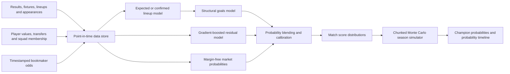

# Süper Lig Forecasting Engine Design

**Date:** 2026-07-23  
**Status:** Approved for implementation planning  
**Scope:** Forecasting engine, data pipeline, twenty-season backtest, Monte Carlo simulator, and reproducible static research report. The interactive dashboard is deferred.

## 1. Objective

Build a point-in-time, player-aware forecasting engine that predicts individual Turkish football matches and derives 2026–27 Süper Lig championship probabilities by simulating the remaining season approximately five million times.

The engine must combine:

- Historical and current player market values.
- Dated squad membership, transfers, lineups, appearances, and availability.
- Match results and competition context.
- Margin-free bookmaker consensus probabilities where timestamped odds are available.
- A four-tier model of the Turkish league pyramid plus Turkish Cup cross-division matches.

The principal quality criterion is forecast accuracy and calibration. The project will not evaluate betting returns or provide betting functionality.

## 2. Deliverables

The first implementation will provide:

1. Reproducible ingestion and normalized storage for Turkish football data.
2. Point-in-time feature and lineup reconstruction.
3. A calibrated hybrid match forecasting model.
4. A season simulator supporting at least five million deterministic simulations.
5. A walk-forward backtest covering twenty scored Süper Lig seasons.
6. Static backtest and probability-timeline charts in a reproducible research report.
7. Stable Python and CLI interfaces plus JSON/Parquet exports for a later dashboard.

The first implementation will not provide:

- An interactive dashboard.
- Betting recommendations, staking, return-on-investment analysis, or arbitrage tools.
- Unlabelled synthetic replacements for missing observed odds or lineups.

## 3. System Architecture



The system is divided into five isolated layers:

### 3.1 Ingestion

Versioned adapters collect fixtures, results, competition rules, players, dated valuations, transfers, appearances, lineups, availability, and odds. Raw source snapshots are immutable.

### 3.2 Identity and point-in-time storage

Canonical club, competition, match, and player identifiers resolve source-specific identities. Every record retains source provenance, retrieval time, effective time, and a raw-record hash.

### 3.3 Match forecasting

An expected-lineup model estimates player selection and minutes. A structural score model supplies a coherent score distribution. Gradient boosting learns residual effects. Available bookmaker odds contribute a margin-free market signal.

### 3.4 Calibration

Walk-forward calibration converts raw model output into calibrated score and 1X2 probabilities. Calibration artifacts are trained only on matches earlier than the evaluated forecast.

### 3.5 Season simulation

The simulator applies season-specific fixtures, rules, points, deductions, and tie-breakers. It samples remaining matches in deterministic vectorized chunks and aggregates position and championship distributions.

## 4. Data Scope

### 4.1 Evaluation period

- **Warm-up target:** 2000–01 through 2005–06 where sources permit.
- **Scored backtest:** 2006–07 through 2025–26.
- **Production forecast:** 2026–27.

The warm-up period supplies prior information so the first scored season can remain out of sample. A coverage matrix must report availability by season, competition, source, and feature family.

### 4.2 Turkish football pyramid

All four national league levels are in ingestion scope, with depth proportional to forecasting value and source quality:

- **Süper Lig:** complete match, player, lineup, valuation, transfer, availability, and odds history.
- **1. Lig:** complete matches, squads, lineups, appearances, valuations, and transfers where available.
- **2. Lig:** matches, squads, transfers, valuations, and detailed lineups where available.
- **3. Lig:** matches, squads, promotions, and player histories where available.
- **Turkish Cup:** cross-division matches used to help estimate league-strength differences.

Sparse lower-tier coverage must be flagged. A lower tier is not assumed to have Süper Lig feature parity.

### 4.3 Source policy

Preferred source classes are:

1. Official TFF records for fixtures, results, rules, and discipline where accessible.
2. Public Transfermarkt-derived structured data for historical players, valuations, transfers, appearances, and lineups.
3. Independent historical odds archives for timestamped market probabilities.
4. Supplementary dated sources for injuries and suspensions when their effective time is verifiable.

Source adapters must preserve raw data and may be replaced without changing downstream domain interfaces. Terms, attribution, and redistribution constraints must be recorded per source.

### 4.4 Point-in-time forecast modes

- **Pre-season:** information available before the season's first kickoff.
- **Expected-lineup:** configurable cutoff, default 24 hours before kickoff.
- **Confirmed-lineup:** announced starting lineup and bench, normally about one hour before kickoff.
- **Live matchday:** completed results enter the next snapshot only after they become final.

The pipeline must not:

- Interpolate a later valuation backward.
- Apply a transfer before its effective date.
- Use confirmed lineups in an earlier expected-lineup forecast.
- Use an odds observation recorded after the forecast cutoff.
- Reconstruct a historical absence from information first published later.

Missing inputs remain missing and activate an explicit fallback mode.

## 5. Promoted-Team and Division Translation

Promoted teams require a hierarchical prior rather than a cold-start constant. For each promoted club, the engine derives:

- Previous-division finish, promotion route, and opponent-adjusted performance.
- Attack and defence ratings in the previous division.
- Squad-value percentile in both the old and new divisions.
- Summer transfers, roster continuity, and expected-lineup change.
- Historical performance of comparable promoted teams.
- A learned division-strength translation informed partly by Turkish Cup matches.

Uncertainty widens when lower-tier coverage is sparse. This uncertainty must propagate through match forecasts and Monte Carlo simulation.

## 6. Hybrid Match Model

### 6.1 Lineup and player strength

For every eligible player, estimate starting probability and expected minutes from information available at the forecast cutoff. Candidate inputs include:

- Dated club membership and eligibility.
- Dated market value.
- Position and age.
- Recent minutes and selection history.
- Transfers and roster continuity.
- Dated injuries and suspensions.

Market values are transformed and normalized by season and position so nominal market inflation across twenty years does not distort comparisons. Confirmed lineups replace expected selections when available.

### 6.2 Structural score model

The structural layer maintains time-varying attacking and defensive strength for teams and player units. It accounts for:

- Home advantage.
- Opponent-adjusted historical goals.
- Promoted-team priors and uncertainty.
- Rest and fixture congestion.
- Managerial or roster discontinuities where reliably timestamped.

A Dixon–Coles-style bivariate goal model produces a coherent scoreline probability matrix and models low-score dependence.

### 6.3 Residual model

Gradient-boosted models learn nonlinear residual effects that remain after the structural prediction. The residual layer must not replace the structural distribution with unrelated classification outputs; it corrects goal or outcome logits while retaining a coherent score distribution.

### 6.4 Market signal

Available bookmaker 1X2 odds are:

1. Stored with provider and observation timestamp.
2. Converted to implied probabilities.
3. Adjusted to remove the bookmaker margin.
4. Combined into a robust consensus.

The market contribution is learned from historical out-of-fold data. Matches without usable odds use the player/results model and are labelled accordingly. No synthetic observed odds are generated.

### 6.5 Blend and calibration

Blend weights are learned inside the training window. The final output is calibrated using only prior matches. Calibration techniques may differ for 1X2 and score distributions but must preserve normalization and coherence.

Each match forecast returns:

- Scoreline distribution.
- Expected goals.
- Home/draw/away probabilities.
- Uncertainty estimates.
- Forecast mode.
- Data-quality and fallback flags.
- Data, feature, and model version identifiers.

## 7. Monte Carlo Season Simulator

The production simulator defaults to **5,000,000 seasons** and supports a configurable count. It must:

- Simulate all remaining fixtures from coherent score distributions.
- Apply the correct points and season-specific tie-break rules.
- Support historical league sizes, formats, postponements, and point deductions.
- Preserve promoted-team, lineup, and model uncertainty where configured.
- Run in deterministic vectorized chunks using a recorded random seed.
- Aggregate champion, position, European-place, and relegation probabilities.
- Record Monte Carlo standard errors or confidence intervals.

Backtest snapshots use adaptive simulation counts until a predefined Monte Carlo error threshold is met. Final season-start forecasts may be rerun at five million for direct comparison. The default five-million run should keep maximum championship-probability sampling error near a few hundredths of a percentage point.

## 8. Backtest Design

### 8.1 Walk-forward protocol

For each scored season:

1. Train and tune only on earlier seasons.
2. Produce a pre-season championship forecast.
3. Predict each match using its historical forecast cutoff.
4. Update ratings only after final results.
5. Recompute and save championship probabilities after each matchday.
6. Complete the season before advancing the training window.

Hyperparameter selection, blend fitting, and calibration must be nested within past data. The evaluated season cannot influence them.

### 8.2 Baselines

The hybrid is compared against:

- Naive home/draw/away frequencies.
- Elo or results-only ratings.
- Squad-value-only predictions.
- Market-odds-only consensus where odds exist.
- The structural goals model without residual or market correction.

### 8.3 Forecast-quality metrics

**Match metrics**

- Multiclass log loss.
- Brier score.
- Ranked probability score.
- Calibration error and reliability curves.
- Score-distribution log score.

**Season metrics**

- Actual champion's preseason rank and assigned probability.
- Championship Brier score and log loss across team-seasons.
- Final-table rank correlation.
- Position error.
- Prediction-interval coverage.

**Evaluation slices**

- Season.
- Promoted versus incumbent club.
- Expected versus confirmed lineup.
- Odds versus no-odds mode.
- Data-quality tier.

### 8.4 Acceptance gate

The hybrid passes when it:

1. Improves out-of-sample log loss and Brier score over simpler baselines.
2. Remains acceptably calibrated overall and on major evaluation slices.
3. Does not depend on one unusually successful season.
4. Shows stable results under paired bootstrap uncertainty analysis.
5. Passes leakage audits and Monte Carlo convergence tests.

Betting returns are not an acceptance metric.

## 9. Probability Timeline and Explanation Data

The engine saves immutable forecast snapshots after each historical and current matchday. The timeline export contains:

- Championship probability by club and snapshot.
- Change since the previous snapshot.
- New match results.
- Squad, valuation, transfer, availability, and lineup changes.
- New market observations.
- Model and data versions.

The engine should calculate counterfactual delta components where technically defensible so the later dashboard can distinguish changes caused by results, squad news, and market movement. These components are explanatory model outputs, not causal claims.

## 10. Interfaces and Storage

DuckDB and Parquet are the internal analytical formats. Compact JSON and Parquet exports form the dashboard boundary.

The public command-line surface is:

```text
fetch-data
build-snapshots
train-model
backtest
forecast-match
forecast-season
export-results
```

The Python API exposes equivalent typed interfaces. Commands accept explicit configuration files and produce manifests containing data hashes, model version, cutoff time, random seed, and runtime configuration.

## 11. Reliability and Error Handling

- Source failures do not overwrite valid snapshots.
- Adapters use retries, caching, and source-specific rate limits.
- Schema changes and invalid records are quarantined.
- Unresolved team or player identities are reported and excluded from affected joins until resolved.
- Coverage thresholds determine whether a model mode is valid.
- Missing odds or lineups activate labelled fallback modes.
- Full-market evaluation is unavailable rather than misleading when minimum odds coverage fails.
- Model artifacts are immutable and content-addressed where practical.
- Long-running backtests and simulations support resumable checkpoints.

## 12. Testing Strategy

### 12.1 Unit and property tests

- Source schemas and normalization.
- Team and player identity resolution.
- Point-in-time joins and leakage prevention.
- Odds-margin removal and consensus construction.
- Expected-lineup probabilities and confirmed-lineup overrides.
- Score probabilities sum to one and remain nonnegative.
- Season-specific tie-break rules.
- Promoted-team division translation.
- Deterministic random-number handling.

### 12.2 Integration and golden tests

- End-to-end replay of representative historical seasons.
- A season with promoted clubs and sparse lower-tier data.
- Expected- and confirmed-lineup forecasts for the same match.
- Market and no-market forecasts for comparable matches.
- Data-source failure and schema-change recovery.

### 12.3 Statistical and performance tests

- Walk-forward leakage audit.
- Calibration sanity and baseline comparison.
- Monte Carlo convergence across seeds and simulation counts.
- Deterministic replay for a fixed seed and artifact set.
- Five-million-season runtime and memory benchmark on the available machine.

## 13. Research Report

The reproducible static report contains:

- Data coverage by season, tier, and feature.
- Match-metric and calibration comparisons.
- Season-level baseline comparisons.
- Promoted-team evaluation.
- Monte Carlo convergence diagnostics.
- Championship probability timelines.
- The 2026–27 pre-season forecast and uncertainty.

The report must distinguish observed facts, forecasts, data limitations, and model uncertainty.

## 14. Deferred Dashboard

The later dashboard will use the approved layered-hybrid layout:

- Championship forecast and probability timeline first.
- Current probabilities and largest movers alongside it.
- Match predictor and validation summary below.
- Detailed match, player, calibration, and methodology views one level deeper.

No dashboard framework or frontend implementation is selected in this phase. The stable JSON/Parquet export contract prevents the engine from depending on that future decision.

## 15. Definition of Done

The engine is complete when:

1. The required Turkish competition data is ingested with provenance and coverage reports.
2. Twenty scored Süper Lig seasons replay without future leakage.
3. Match and championship predictions are measured against all specified baselines.
4. The hybrid meets or transparently fails the forecast-quality acceptance gate.
5. A deterministic five-million-season 2026–27 simulation completes with convergence diagnostics.
6. Static backtest and probability-timeline graphs are reproducible.
7. Engine outputs are available through the documented Python, CLI, JSON, and Parquet interfaces.
8. Tests, data-quality checks, and the research report complete successfully.
